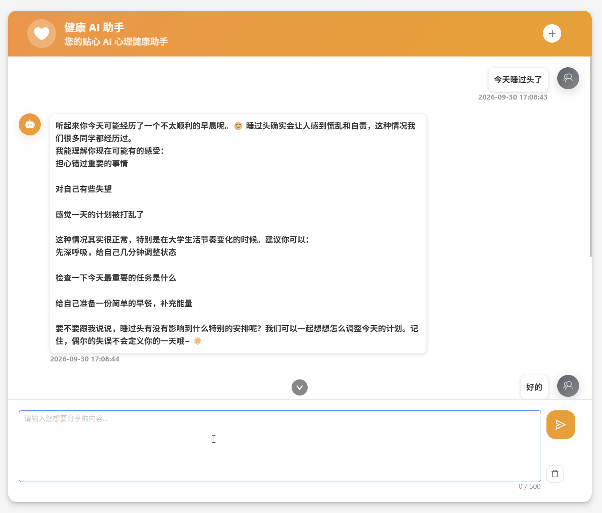
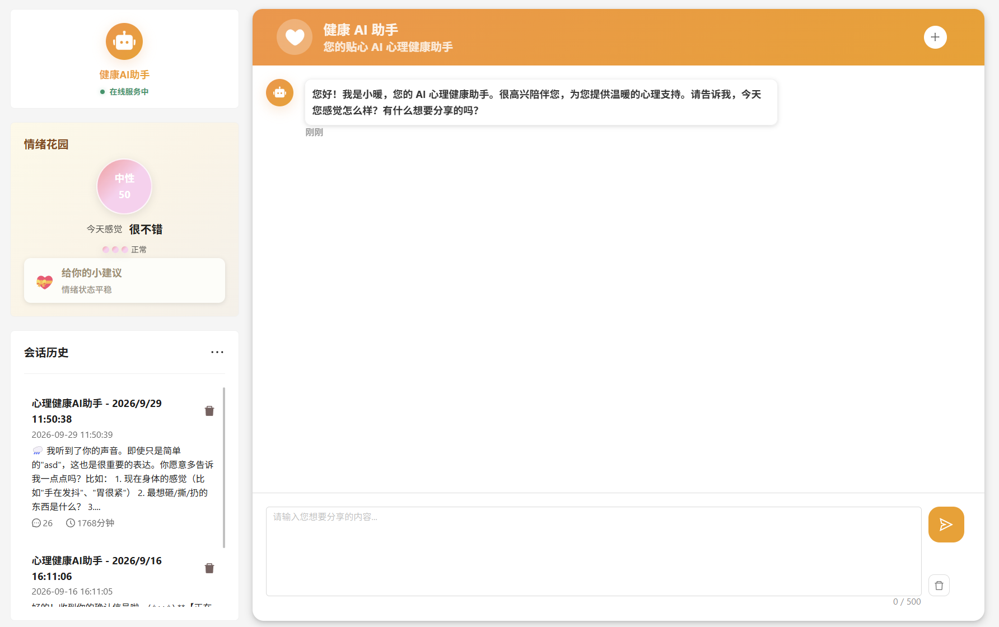
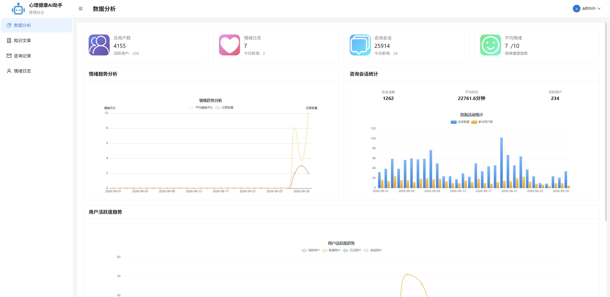

# AI 心理健康咨询平台

<p>
  
  
  
  
  
  
</p>

基于 **React + Vite + TypeScript** 的 AI 心理健康咨询平台，**用户端 / 管理端双端一体**。用户端提供 AI 心理咨询（流式对话）、情绪日记、心理知识库与文章阅读；管理端提供数据看板、知识文章管理、咨询记录查看与情绪日志管理。通过 AI 对话辅助用户进行情绪疏导，并对情绪状态做分级预警。

> 在线体验：<https://aihealth.liberorreactproject.beer>　·　源码：<https://github.com/liberor/ai-mental-health>

> 说明：项目面向 **1920px 及以上** 的桌面端设计，小屏会跳转到适配提示页。

## 功能特性

### 用户端

- **AI 心理咨询**：基于 `@microsoft/fetch-event-source` 的 SSE 流式对话，支持中断、历史会话与情绪分析结果展示
- **情绪花园**：展示情绪得分、主情绪、风险等级与改善建议
- **情绪日记**：记录与回顾每日情绪
- **心理知识库 / 文章**：文章列表（含图片懒加载）与详情阅读

### 管理端

- **数据看板**：ECharts 可视化统计
- **知识文章管理**：富文本编辑（WangEditor）
- **咨询记录查看**
- **情绪日志管理**

## 技术栈

| 分类 | 技术 |
| --- | --- |
| 框架 | React 19 + TypeScript |
| 构建 | Vite 8 |
| 路由 | React Router v7（路由懒加载 + Loader 守卫） |
| UI | Ant Design 6 + Tailwind CSS 4 |
| 请求 | Axios（请求/响应拦截封装） |
| 流式通信 | @microsoft/fetch-event-source（SSE）+ AbortController |
| 图表 / 动画 | ECharts 6 + GSAP |
| 富文本 | WangEditor |
| 规范 | Oxlint |

## 项目截图


AI对话演示：



AI对话界面：



后台首页：


## 快速开始

### 环境要求

- Node.js >= 18
- 推荐浏览器分辨率 1920px 及以上

### 安装与运行

```bash
# 克隆
git clone https://github.com/liberor/ai-mental-health.git
cd ai-mental-health

# 安装依赖
npm install

# 启动开发服务（自动打开浏览器）
npm run dev

# 构建生产包
npm run build

# 本地预览生产包
npm run preview

# 代码检查
npm run lint
```

### 环境变量

在项目根目录的 `.env.development` / `.env.production` 中配置：

| 变量 | 说明 | 默认值 |
| --- | --- | --- |
| `VITE_APP_BASE_API` | 接口基础路径 | `/api` |
| `VITE_APP_BASE_FILES` | 静态资源基础路径 | 空 |

> 开发环境通过 `vite.config.ts` 将 `/api`、`/files` 代理到后端服务；生产环境由 Nginx 反向代理。

## 目录结构

```
src
├─ api/            # 接口定义（按业务模块拆分）
├─ assets/         # 图片等静态资源
├─ components/     # 通用组件（BackLayout、GardenDots 等）
├─ pages/          # 页面（用户端 + 管理端）
├─ utils/          # 工具函数（如 contentToMarkdown）
├─ axios.ts        # Axios 实例与请求/响应拦截
├─ router.tsx      # 路由与权限守卫
├─ main.tsx        # 应用入口
└─ App.tsx
```

## 核心实现

- **双端路由与鉴权**：用户端 `/`、管理端 `/back` 两套路由，基于 `localStorage` 中的 `token` 与 `userType` 在 Loader 中做登录与角色校验（用户 / 管理员隔离）。
- **请求层封装**：`axios.ts` 请求拦截注入 token；响应拦截按业务码拆包，统一处理登录过期并跳转登录页。
- **SSE 流式对话**：使用 `fetch-event-source` 消费服务端流式输出，配合 `AbortController` 实现中断控制。
- **图片懒加载**：使用 `IntersectionObserver` 实现知识库文章列表图片懒加载。
- **首屏优化**：全站路由懒加载，首页 JS 资源由 **1.2MB 降至 288KB（-76%）**，首屏加载由约 **5s 优化至约 2s**。

## 部署

```bash
npm run build   # 产出 dist/
```

将 `dist/` 部署到静态服务器（如 Nginx），并配置 `/api`、`/files` 反向代理到后端服务即可。

## License

[MIT](./LICENSE) © 2026 liberor
